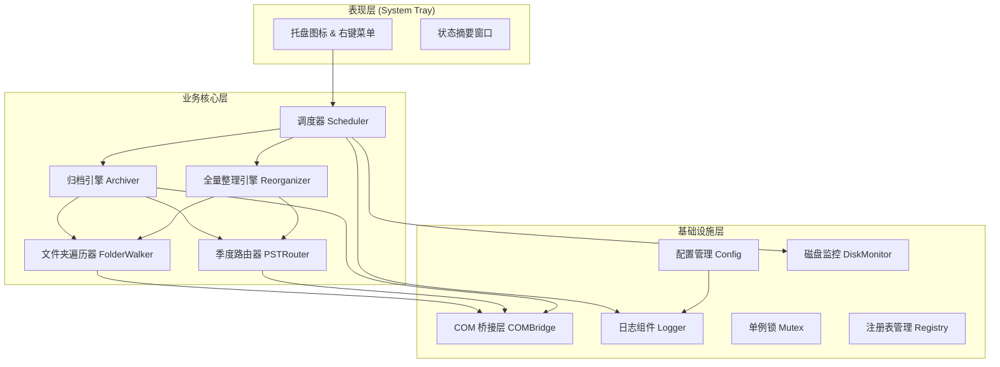
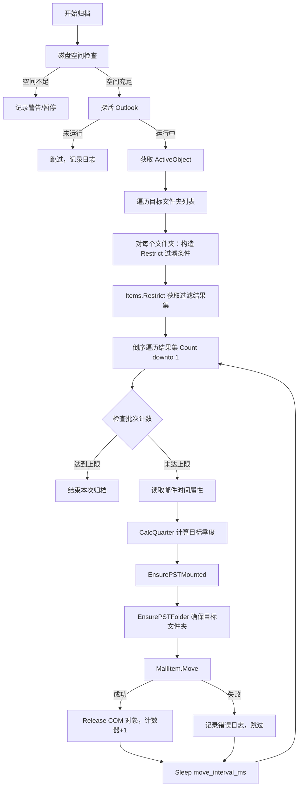
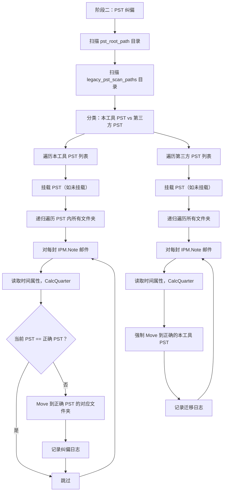

# Golang 开发规划设计书：Outlook Auto-Archiver

| 属性     | 值                                                         |
| -------- | ---------------------------------------------------------- |
| 文档版本 | v1.0                                                       |
| 编写日期 | 2026-07-03                                                 |
| 需求依据 | [项目需求说明书 v1.2](file:///d:/Document/GO/outlookTool/项目需求说明书.md) |
| 开发语言 | Go 1.22+                                                   |

---

## 1. 整体架构

### 1.1 架构概览

采用**分层架构 + 事件驱动**设计，将 COM 操作集中在单一线程，业务逻辑与 UI 交互解耦。



### 1.2 目录结构

```
outlook-archiver/
├── main.go                     # 程序入口
├── go.mod
├── go.sum
├── config.yaml                 # 默认配置文件（随程序分发）
├── build/
│   └── icon.ico                # 托盘图标资源文件
├── internal/
│   ├── app/
│   │   └── app.go              # 应用生命周期管理（启动、关闭）
│   ├── config/
│   │   └── config.go           # YAML 配置加载与校验
│   ├── mutex/
│   │   └── mutex.go            # Windows 系统级单例锁
│   ├── tray/
│   │   ├── tray.go             # 系统托盘图标与菜单
│   │   └── status.go           # 状态摘要窗口
│   ├── scheduler/
│   │   └── scheduler.go        # 定时调度器（启停控制）
│   ├── outlook/
│   │   ├── bridge.go           # COM 桥接层：初始化、探活、GetActiveObject
│   │   ├── folder.go           # 文件夹遍历与过滤
│   │   ├── mail.go             # 邮件属性读取与 Move 操作
│   │   ├── pst.go              # PST 挂载、创建、路径检查
│   │   └── store.go            # Store 遍历与管理
│   ├── archiver/
│   │   ├── archiver.go         # 常规归档引擎
│   │   └── reorganizer.go      # 全量整理引擎
│   ├── router/
│   │   └── quarter.go          # 季度路由计算（Year/Quarter 映射）
│   ├── monitor/
│   │   └── disk.go             # 磁盘空间与 PST 大小监控
│   ├── registry/
│   │   └── autostart.go        # 注册表开机自启管理
│   └── logger/
│       └── logger.go           # zap + lumberjack 日志初始化
├── pkg/
│   └── comutil/
│       └── safe.go             # COM 安全操作封装（SafeCallMethod、SafeRelease）
└── logs/                       # 运行时日志输出目录
```

## 2. 核心模块详细设计

### 2.1 配置管理 (`internal/config`)

```go
type Config struct {
    PSTRootPath       string   `yaml:"pst_root_path"`
    PollIntervalMin   int      `yaml:"poll_interval_minutes"`
    SafeDelayMin      int      `yaml:"safe_delay_minutes"`
    MaxBatchSize      int      `yaml:"max_batch_size"`
    ArchiveMode       string   `yaml:"archive_mode"`        // "all" | "list"
    ExcludeFolders    []string `yaml:"exclude_folders"`
    IncludeFolders    []string `yaml:"include_folders"`
    LogRetentionDays  int      `yaml:"log_retention_days"`
    MoveIntervalMs    int      `yaml:"move_interval_ms"`
    DryRun            bool     `yaml:"dry_run"`              // true = 仅日志，不执行 Move
    LegacyPSTScanPaths []string `yaml:"legacy_pst_scan_paths"`
}
```

**设计要点**：

- 配置文件路径：优先读取程序同目录下的 `config.yaml`，不存在时自动生成默认配置
- 启动时执行完整性校验：`pst_root_path` 是否存在、数值参数范围检查
- 配置变更：本版本不支持热加载，修改后需重启程序（托盘菜单提供"打开配置文件"入口）

### 2.2 单例锁 (`internal/mutex`)

```go
// TryLock 尝试获取系统级互斥锁
// 命名格式: Global\OutlookAutoArchiver_{UserSID}
func TryLock() (release func(), err error)
```

**实现方式**：

- 调用 `kernel32.dll` 的 `CreateMutexW` API
- 通过 `GetLastError()` 检测 `ERROR_ALREADY_EXISTS`
- 获取当前用户 SID 拼接到 Mutex 名称中，避免多用户冲突
- 返回 `release` 函数在程序退出时调用 `ReleaseMutex` + `CloseHandle`

### 2.3 COM 桥接层 (`internal/outlook`)

这是整个程序最核心、最危险的模块。**所有 COM 操作必须在同一个 OS 线程中执行。**

#### 2.3.1 线程模型

```go
// bridge.go
type COMBridge struct {
    taskCh   chan func()  // 所有 COM 操作通过此 channel 提交
    resultCh chan error
}

// Run 启动 COM 工作线程（必须在独立 goroutine 中调用）
func (b *COMBridge) Run(ctx context.Context) {
    runtime.LockOSThread()
    defer runtime.UnlockOSThread()

    ole.CoInitializeEx(0, ole.COINIT_APARTMENTTHREADED)
    defer ole.CoUninitialize()

    for {
        select {
        case task := <-b.taskCh:
            task()  // 在锁定的 OS 线程上执行
        case <-ctx.Done():
            return
        }
    }
}

// Submit 向 COM 线程提交操作并等待结果
func (b *COMBridge) Submit(fn func() error) error
```

> ⚠️ **关键设计决策**：采用 **channel 投递 + 单线程消费** 模式，而非在每个 goroutine 中各自 `LockOSThread`。原因：
> 1. 确保所有 COM 对象生命周期在同一线程
> 2. 避免 Go runtime 线程池膨胀
> 3. 天然串行化，避免并发操作 Outlook 导致的 RPC 冲突

#### 2.3.2 COM 安全封装 (`pkg/comutil`)

```go
// SafeRelease 安全释放 COM 对象，带 nil 检查和 panic recovery
func SafeRelease(disp *ole.IDispatch)

// SafeCallMethod 调用 COM 方法，自动处理错误码分类
func SafeCallMethod(disp *ole.IDispatch, method string, params ...interface{}) (*ole.VARIANT, error)

// SafeGetProperty 获取 COM 属性值
func SafeGetProperty(disp *ole.IDispatch, prop string) (*ole.VARIANT, error)
```

#### 2.3.3 Outlook 探活

```go
// bridge.go
// IsOutlookRunning 通过 Windows API 扫描进程列表
func IsOutlookRunning() bool

// GetActiveOutlook 获取当前运行的 Outlook 实例
// 返回 Application 的 IDispatch 指针
func (b *COMBridge) GetActiveOutlook() (*ole.IDispatch, error)
```

**实现方式**：

- `IsOutlookRunning()`：调用 `CreateToolhelp32Snapshot` + `Process32Next` 枚举进程，匹配 `OUTLOOK.EXE`（大小写不敏感）
- `GetActiveOutlook()`：调用 `oleutil.GetActiveObject("Outlook.Application")`，失败时返回错误而非 panic

### 2.4 季度路由器 (`internal/router`)

```go
// quarter.go

// QuarterInfo 季度信息
type QuarterInfo struct {
    Year    int // e.g. 2024
    Quarter int // 1-4
}

// CalcQuarter 根据邮件时间计算所属季度
// 严禁传入 time.Now()，只接受邮件属性时间
func CalcQuarter(mailTime time.Time) QuarterInfo

// PSTFileName 生成 PST 文件名：2024_Q2.pst
func (q QuarterInfo) PSTFileName() string

// PSTFilePath 生成 PST 完整路径
func (q QuarterInfo) PSTFilePath(rootPath string) string

// DisplayName 生成 Outlook 侧边栏显示名：2024_Q2
func (q QuarterInfo) DisplayName() string

// IsOurPSTName 判断文件名是否符合本工具命名规范
// 用于全量整理时区分本工具 PST 和第三方 PST
func IsOurPSTName(filename string) bool
```

`IsOurPSTName` 使用正则 `^\d{4}_Q[1-4]\.pst$` 进行匹配。

### 2.5 PST 管理 (`internal/outlook/pst.go`)

```go
// EnsurePSTMounted 确保指定季度的 PST 文件已挂载
// 1. 遍历 Stores，按 FilePath 比对（非名称）
// 2. 未挂载则 AddStore
// 3. 返回 PST 的根 Folder IDispatch
func (b *COMBridge) EnsurePSTMounted(quarter QuarterInfo) (*ole.IDispatch, error)

// EnsurePSTFolder 确保 PST 内指定路径的文件夹存在
// 支持多级路径如 "客户跟进/重要"，不存在则递归创建
func (b *COMBridge) EnsurePSTFolder(pstRoot *ole.IDispatch, folderPath string) (*ole.IDispatch, error)

// IsStoreMounted 通过物理路径判断 Store 是否已挂载
func (b *COMBridge) IsStoreMounted(filePath string) (bool, error)
```

### 2.6 文件夹遍历器 (`internal/outlook/folder.go`)

```go
// FolderInfo 文件夹描述信息
type FolderInfo struct {
    Name        string           // 文件夹名称
    FullPath    string           // 相对于邮箱根的完整路径，如 "客户跟进/重要"
    FolderType  FolderType       // Default / Custom
    TimeField   string           // "SentOn" 或 "ReceivedTime"
    Dispatch    *ole.IDispatch   // COM 对象（使用后需 Release）
}

// WalkMailboxFolders 遍历主邮箱的所有文件夹
// 根据 ArchiveMode 和 ExcludeFolders/IncludeFolders 过滤
func (b *COMBridge) WalkMailboxFolders(cfg *config.Config) ([]FolderInfo, error)

// WalkPSTFolders 遍历指定 PST 内的所有文件夹
// 用于全量整理的 PST 纠偏阶段
func (b *COMBridge) WalkPSTFolders(pstRoot *ole.IDispatch) ([]FolderInfo, error)
```

**系统保留文件夹排除列表**（硬编码，不可配置）：

| 文件夹名 | OlDefaultFolders 枚举值 |
|----------|------------------------|
| 已删除邮件 | `olFolderDeletedItems(3)` |
| 发件箱 | `olFolderOutbox(4)` |
| 草稿 | `olFolderDrafts(16)` |
| 垃圾邮件 | `olFolderJunk(23)` |
| 同步问题 | `olFolderSyncIssues(20)` |
| 同步问题/冲突 | 子文件夹 |
| 同步问题/本地故障 | 子文件夹 |
| 同步问题/服务器故障 | 子文件夹 |

### 2.7 归档引擎 (`internal/archiver`)

#### 2.7.1 常规归档 (`archiver.go`)

```go
// ArchiveResult 归档执行结果
type ArchiveResult struct {
    TotalMatched  int
    TotalMoved    int
    TotalFailed   int
    TotalSkipped  int
    Duration      time.Duration
    Errors        []MailError
}

// Archive 执行一次常规归档
// options 控制批次限制和延迟过滤行为
func (a *Archiver) Archive(ctx context.Context, opts ArchiveOptions) (*ArchiveResult, error)

type ArchiveOptions struct {
    MaxBatchSize     int           // 0 = 不限制（全量整理模式）
    SafeDelay        time.Duration // 0 = 不延迟（全量整理模式）
    MoveInterval     time.Duration
    DryRun           bool          // true = 仅日志，不执行 Move
}
```

**核心流程**：



#### 2.7.2 全量整理 (`reorganizer.go`)

```go
// ReorganizeResult 全量整理结果
type ReorganizeResult struct {
    Phase1 ArchiveResult  // 阶段一：邮箱归档
    Phase2 RectifyResult  // 阶段二：PST 纠偏
}

type RectifyResult struct {
    OurPSTScanned      int  // 本工具 PST 扫描数
    LegacyPSTScanned   int  // 第三方 PST 扫描数
    TotalRectified     int  // 纠偏邮件数
    TotalMigrated      int  // 第三方 PST 迁移数
    TotalFailed        int
    Duration           time.Duration
}

// Reorganize 执行全量整理
func (r *Reorganizer) Reorganize(ctx context.Context) (*ReorganizeResult, error)
```

**阶段二核心流程**：



**第三方 PST 自动发现逻辑**：

```go
// DiscoverLegacyPSTs 自动发现第三方 PST 文件
func DiscoverLegacyPSTs(scanPaths []string, ourRootPath string) ([]string, error) {
    // 1. 遍历每个 scanPath 目录
    // 2. filepath.Glob("*.pst") 获取所有 PST 文件
    // 3. 对每个文件，调用 router.IsOurPSTName() 判断命名
    // 4. 排除本工具命名格式的文件
    // 5. 返回剩余的第三方 PST 文件路径列表
}
```

### 2.8 调度器 (`internal/scheduler`)

```go
type Scheduler struct {
    cfg      *config.Config
    archiver *archiver.Archiver
    reorg    *archiver.Reorganizer
    ticker   *time.Ticker
    state    SchedulerState  // Idle / Archiving / Reorganizing / Paused
    mu       sync.Mutex
}

type SchedulerState int

const (
    StateIdle SchedulerState = iota
    StateArchiving
    StateReorganizing
    StatePaused
)

// Start 启动定时调度
func (s *Scheduler) Start(ctx context.Context)

// Stop 停止调度器
func (s *Scheduler) Stop()

// TriggerOnce 手动触发一次常规归档
func (s *Scheduler) TriggerOnce() error

// TriggerReorganize 触发全量整理（暂停定时器 → 执行 → 恢复）
func (s *Scheduler) TriggerReorganize(ctx context.Context, progressCb func(ProgressInfo)) error

// GetState 获取当前状态（供托盘 UI 查询）
func (s *Scheduler) GetState() SchedulerState

// ProgressInfo 进度信息（供托盘 Tooltip 显示）
type ProgressInfo struct {
    Phase       int    // 1 或 2
    Processed   int
    Rectified   int
    CurrentPST  string
}
```

### 2.9 系统托盘 (`internal/tray`)

**推荐库**：`github.com/getlantern/systray`

```go
// tray.go
func InitTray(scheduler *Scheduler, cfg *config.Config) {
    systray.Run(onReady, onExit)
}

func onReady() {
    systray.SetIcon(normalIcon)
    systray.SetTooltip("Outlook Auto-Archiver - 运行中")

    mArchiveOnce := systray.AddMenuItem("立即执行一次", "手动触发常规归档")
    mReorganize  := systray.AddMenuItem("全量整理", "全量归档+PST纠偏")
    systray.AddSeparator()
    mOpenLog     := systray.AddMenuItem("打开日志目录", "")
    mOpenConfig  := systray.AddMenuItem("打开配置文件", "")
    mAutoStart   := systray.AddMenuItemCheckbox("开机自启", "", isAutoStartEnabled())
    systray.AddSeparator()
    mQuit        := systray.AddMenuItem("退出", "")

    // 事件循环处理各菜单项点击...
}
```

**全量整理期间的 UI 状态变化**：

| 时机 | 图标 | Tooltip | 菜单状态 |
|------|------|---------|---------|
| 空闲 | 正常图标 | `Outlook Auto-Archiver - 运行中` | 全部可用 |
| 常规归档中 | 正常图标 | `归档中...` | `立即执行一次` 置灰 |
| 全量整理中 | 旋转图标 | `全量整理中... 阶段1/2 - 已处理 N 封` | 两项均置灰 |
| 磁盘空间警告 | 警告图标 | `磁盘空间不足` | 全部可用 |

### 2.10 日志组件 (`internal/logger`)

```go
func InitLogger(cfg *config.Config) (*zap.Logger, error) {
    w := &lumberjack.Logger{
        Filename:   filepath.Join(exeDir(), "logs", "archiver.log"),
        MaxSize:    50,                    // MB
        MaxAge:     cfg.LogRetentionDays,  // 天
        LocalTime:  true,
        Compress:   false,
    }
    core := zapcore.NewCore(
        zapcore.NewJSONEncoder(zap.NewProductionEncoderConfig()),
        zapcore.AddSync(w),
        zapcore.InfoLevel,
    )
    return zap.New(core), nil
}
```

### 2.11 磁盘监控 (`internal/monitor`)

```go
// CheckDiskSpace 检查目标目录可用空间
func CheckDiskSpace(path string) (DiskStatus, error)

type DiskStatus int
const (
    DiskOK      DiskStatus = iota
    DiskWarning            // < 1GB
    DiskCritical           // < 500MB
)

// CheckPSTSize 检查单个 PST 文件大小
func CheckPSTSize(pstPath string) (PSTSizeStatus, error)

type PSTSizeStatus int
const (
    PSTSizeOK      PSTSizeStatus = iota
    PSTSizeWarning               // > 15GB
    PSTSizeCritical              // > 20GB
)
```

### 2.12 注册表管理 (`internal/registry`)

```go
// SetAutoStart 写入/删除开机自启注册表项
// HKCU\Software\Microsoft\Windows\CurrentVersion\Run
func SetAutoStart(enabled bool) error

// IsAutoStartEnabled 检查当前是否已启用自启
func IsAutoStartEnabled() bool
```

## 3. 关键技术实现细节

### 3.1 COM 对象生命周期管理

这是程序稳定性的生命线。采用 **RAII 风格封装**：

```go
// pkg/comutil/safe.go

// COMRef 包装 COM 对象引用，确保释放
type COMRef struct {
    disp *ole.IDispatch
    name string  // 用于调试日志
}

func NewCOMRef(disp *ole.IDispatch, name string) *COMRef {
    return &COMRef{disp: disp, name: name}
}

func (r *COMRef) Release() {
    if r != nil && r.disp != nil {
        r.disp.Release()
        r.disp = nil
    }
}

func (r *COMRef) Dispatch() *ole.IDispatch {
    return r.disp
}
```

**在邮件处理循环中的正确用法**：

```go
// 倒序遍历 — 防越界核心法则
count := getItemCount(items)
for i := count; i >= 1; i-- {
    // 获取单封邮件
    itemRef := NewCOMRef(getItem(items, i), fmt.Sprintf("mail_%d", i))

    // 读取属性
    timeVal, err := SafeGetProperty(itemRef.Dispatch(), timeField)
    if err != nil {
        logger.Warn("读取时间属性失败", zap.Error(err))
        itemRef.Release()  // ← 立即释放，不堆积
        continue
    }

    subject := getSubject(itemRef.Dispatch())
    quarter := router.CalcQuarter(parseTime(timeVal))

    // dry_run 模式：仅输出日志，不执行 Move
    if opts.DryRun {
        logger.Info("[DRY RUN] 将会移动邮件",
            zap.String("subject", subject),
            zap.Time("mail_time", parseTime(timeVal)),
            zap.String("source_folder", folder.FullPath),
            zap.String("target_pst", quarter.PSTFileName()),
        )
    } else {
        // 真正执行 Move
        err = moveItem(itemRef.Dispatch(), targetFolder)
        if err != nil {
            logger.Error("移动邮件失败", zap.String("subject", subject), zap.Error(err))
            failed++
        } else {
            moved++
        }
    }

    itemRef.Release()  // ← 每次循环结束立即释放

    time.Sleep(opts.MoveInterval)
}
```

### 3.2 Restrict 过滤条件构造

```go
// BuildRestrictFilter 根据文件夹类型构造 DASL 过滤条件
func BuildRestrictFilter(timeField string, cutoffTime time.Time) string {
    // 格式化为 Outlook 可接受的时间字符串
    timeStr := cutoffTime.Format("2006-01-02 15:04:05")
    return fmt.Sprintf("[%s] < '%s' AND [MessageClass] = 'IPM.Note'", timeField, timeStr)
}
```

### 3.3 倒序遍历实现

```go
// processFolder 处理单个文件夹的归档
func (a *Archiver) processFolder(ctx context.Context, folder FolderInfo, opts ArchiveOptions) (moved, failed int) {
    // 1. 获取 Items 集合
    items := getItems(folder.Dispatch)
    defer SafeRelease(items)

    // 2. 构造过滤条件并 Restrict
    filter := BuildRestrictFilter(folder.TimeField, calcCutoffTime(opts.SafeDelay))
    restricted := restrict(items, filter)
    defer SafeRelease(restricted)

    // 3. 获取 Count
    count := getCount(restricted)

    // 4. 倒序遍历
    for i := count; i >= 1; i-- {
        if opts.MaxBatchSize > 0 && moved >= opts.MaxBatchSize {
            break  // 达到批次上限
        }
        // ... 处理单封邮件 ...
    }
    return
}
```

### 3.4 已发送文件夹特殊识别

已发送邮件文件夹需使用 `SentOn` 而非 `ReceivedTime`。识别方式：

```go
// isSentItemsFolder 判断文件夹是否为"已发送邮件"
// 通过比较 Folder 的 EntryID 与 GetDefaultFolder(5) 的 EntryID
func (b *COMBridge) isSentItemsFolder(folder *ole.IDispatch) bool {
    sentFolder := getDefaultFolder(namespace, 5)
    defer SafeRelease(sentFolder)
    return getEntryID(folder) == getEntryID(sentFolder)
}
```

## 4. 第三方依赖库

| 库 | 版本 | 用途 | 需求对应 |
|----|------|------|---------|
| `github.com/go-ole/go-ole` | v1.3+ | Windows COM 接口调用 | §2 技术选型 |
| `go.uber.org/zap` | v1.27+ | 结构化高性能日志 | §6.3 日志要求 |
| `gopkg.in/natefinch/lumberjack.v2` | v2.2+ | 日志文件轮转 | §6.3 日志要求 |
| `gopkg.in/yaml.v3` | v3.0+ | YAML 配置解析 | §6.2 配置文件 |
| `github.com/getlantern/systray` | v1.2+ | 系统托盘图标 | §6.1 部署形式 |
| `golang.org/x/sys/windows` | latest | Windows API 调用（进程枚举、注册表、Mutex） | §3.1 进程管理 |

## 5. 需求覆盖核验矩阵

> 以下矩阵逐项核验需求文档中的每一条功能要求是否在设计中得到覆盖。

| 需求编号 | 需求描述 | 设计覆盖模块 | 状态 |
|---------|---------|-------------|------|
| §3.1.1 | 系统级 Mutex 单例锁 | `internal/mutex` | ✅ 已覆盖 |
| §3.1.2 | 定时器轮询 | `internal/scheduler` | ✅ 已覆盖 |
| §3.1.3 | Outlook 进程探活 | `internal/outlook/bridge.go` | ✅ 已覆盖 |
| §3.2.1 | 严禁使用系统时间，使用邮件属性时间 | `internal/router/quarter.go` | ✅ 已覆盖 |
| §3.2.2 | PST 命名规范 `{Year}_Q{Quarter}` | `internal/router/quarter.go` | ✅ 已覆盖 |
| §3.2.3 | 防重挂载（按 FilePath 判断） | `internal/outlook/pst.go` | ✅ 已覆盖 |
| §3.3.1A | 默认文件夹归档 | `internal/outlook/folder.go` | ✅ 已覆盖 |
| §3.3.1B | 自定义文件夹递归遍历归档 | `internal/outlook/folder.go` | ✅ 已覆盖 |
| §3.3.1C | 自定义文件夹使用 ReceivedTime，回退 CreationTime | `internal/outlook/mail.go` | ✅ 已覆盖 |
| §3.3.2 | Restrict 前置过滤，禁止全量遍历 | `internal/archiver/archiver.go` | ✅ 已覆盖 |
| §3.3.2 | MessageClass 类型过滤 | Restrict 条件内置 | ✅ 已覆盖 |
| §3.3.3 | 批次限制 max_batch_size | `ArchiveOptions.MaxBatchSize` | ✅ 已覆盖 |
| §3.3.3 | Move 间隔 Sleep | `ArchiveOptions.MoveInterval` | ✅ 已覆盖 |
| §3.3.3 | dry_run 模拟运行模式 | `ArchiveOptions.DryRun` + Move 前分支判断 | ✅ 已覆盖 |
| §3.4 | PST 内文件夹结构镜像 | `internal/outlook/pst.go#EnsurePSTFolder` | ✅ 已覆盖 |
| §3.5.1 | 全量整理流程（暂停→归档→纠偏→恢复） | `internal/scheduler` + `internal/archiver/reorganizer.go` | ✅ 已覆盖 |
| §3.5.2 | 阶段一：不限批次、不限延迟 | `ArchiveOptions` 零值控制 | ✅ 已覆盖 |
| §3.5.3A | 自动扫描第三方 PST（目录遍历 + 排除本工具命名） | `DiscoverLegacyPSTs` | ✅ 已覆盖 |
| §3.5.3B | 本工具 PST 纠偏 | `reorganizer.go` | ✅ 已覆盖 |
| §3.5.3C | 第三方 PST 全量迁移 | `reorganizer.go` | ✅ 已覆盖 |
| §3.5.4 | 托盘进度反馈 + 互斥保护 | `internal/tray` + `SchedulerState` | ✅ 已覆盖 |
| §4.1 | 禁止直接文件 I/O | 架构约束（所有操作通过 COMBridge） | ✅ 已覆盖 |
| §4.2 | 强制 LockOSThread | `COMBridge.Run()` 单线程模型 | ✅ 已覆盖 |
| §4.3 | 严格 Release | `COMRef` RAII 封装 | ✅ 已覆盖 |
| §4.4 | 倒序遍历 | `processFolder` 倒序循环 | ✅ 已覆盖 |
| §4.5 | CallMethod 防御性编程 | `SafeCallMethod` 封装 | ✅ 已覆盖 |
| §5.1 | 异常分级处理 | 各模块 error 分类 + logger | ✅ 已覆盖 |
| §5.2 | 磁盘空间监控 | `internal/monitor/disk.go` | ✅ 已覆盖 |
| §5.3 | PST 大小监控 | `internal/monitor/disk.go` | ✅ 已覆盖 |
| §6.1 | 系统托盘 + 右键菜单 | `internal/tray` | ✅ 已覆盖 |
| §6.2 | YAML 配置文件 | `internal/config` | ✅ 已覆盖 |
| §6.3 | zap + lumberjack 日志 | `internal/logger` | ✅ 已覆盖 |

**核验结论**：需求文档中的所有功能点均已在设计中找到对应模块，无遗漏。

## 6. 可优化项与建议

### 6.1 架构层面优化

| 编号 | 优化项 | 说明 | 优先级 |
|------|--------|------|--------|
| O-01 | **COM 操作重试机制** | 当 `MailItem.Move()` 返回可重试错误（如 `MAPI_E_TIMEOUT`、`RPC_E_CALL_REJECTED`）时，加入指数退避重试（最多 3 次），而非直接跳过。可显著降低网络波动导致的假性失败。 | 高 |
| O-02 | **PST Store 缓存** | 每次归档都遍历 `Session.Stores` 集合查找已挂载 PST 效率较低。可在首次查询后缓存 `FilePath → Store` 映射，仅在 `AddStore` 操作后刷新缓存。 | 高 |
| O-03 | **配置热加载** | 当前设计修改配置需重启。可通过 `fsnotify` 监听 `config.yaml` 文件变化，实现运行时热加载（仅限安全参数如 `poll_interval_minutes`、`max_batch_size`）。 | 中 |
| O-04 | **归档统计持久化** | 将每次归档的统计结果（处理数、耗时等）写入本地 SQLite 或 JSON 文件，托盘状态窗口可展示历史趋势。 | 低 |

### 6.2 稳定性优化

| 编号 | 优化项 | 说明 | 优先级 |
|------|--------|------|--------|
| O-05 | **Outlook 意外关闭检测** | 在归档循环中定期（如每 50 封）检查 Outlook 进程是否仍然存活。若 Outlook 已被用户关闭，立即中止当前任务，避免后续 COM 调用产生大量错误。 | 高 |
| O-06 | **COM 超时保护** | 对每次 COM 调用设置超时上限（如 30 秒）。使用 `context.WithTimeout` 配合 COMBridge 的 Submit 机制。防止 Outlook 假死导致程序卡死。 | 高 |
| O-07 | **全量整理断点续做** | 全量整理可能处理数万封邮件，耗时数小时。若中途 Outlook 崩溃或用户关机，下次启动后应能从上次中断的 PST/文件夹位置继续，而非重头开始。可记录进度到本地文件。 | 中 |
| O-08 | **Panic Recovery** | 在 COMBridge 的任务执行中加入 `recover()` 保护，单次 COM 操作的 panic 不应导致整个工作线程崩溃。 | 高 |

### 6.3 性能优化

| 编号 | 优化项 | 说明 | 优先级 |
|------|--------|------|--------|
| O-09 | **Restrict 条件预构建** | 对于每个文件夹，在获取 Items 前先构建好 Restrict 字符串，避免在循环内反复拼接字符串。 | 低 |
| O-10 | **批量 PST 挂载优化** | 全量整理阶段二需挂载大量 PST。可先收集所有需要挂载的 PST 列表，批量执行 `AddStore`，减少反复查找 Stores 的开销。 | 中 |
| O-11 | **Move 间隔自适应** | 根据 Outlook 的响应速度动态调整 `move_interval_ms`：若连续 10 次 Move 耗时 < 50ms，可缩短间隔；若出现 RPC 超时，自动加大间隔。 | 低 |

### 6.4 用户体验优化

| 编号 | 优化项 | 说明 | 优先级 |
|------|--------|------|--------|
| O-12 | **全量整理确认对话框** | 全量整理是一个重量级操作，点击菜单后应弹出确认对话框说明预计影响，用户确认后再执行。 | 高 |
| O-13 | **全量整理完成报告** | 全量整理完成后，除了系统通知外，可自动生成一份 HTML/文本报告，列出每个 PST 的处理详情，方便用户核查。保存到 `logs/reorganize_report_YYYYMMDD.html`。 | 中 |
| O-14 | **托盘气泡通知** | 常规归档完成后，通过 Windows Toast 通知显示简要结果（如"本次归档 12 封邮件"），让用户知道程序在正常工作。可配置开关，避免打扰。 | 低 |

## 7. 开发阶段规划

| 阶段 | 内容 | 产出物 | 预估耗时 |
|------|------|--------|---------|
| **P1 基础框架** | 项目骨架、配置加载、日志初始化、单例锁、COM 桥接层搭建 | 可编译运行的空壳程序 | 2 天 |
| **P2 核心归档** | 季度路由、PST 挂载管理、文件夹遍历、Restrict 过滤、Move 操作、倒序遍历 | 可执行常规归档的命令行程序 | 4 天 |
| **P3 全量整理** | PST 扫描、纠偏逻辑、第三方 PST 自动发现与迁移 | 全量整理功能可用 | 3 天 |
| **P4 托盘 UI** | 系统托盘、右键菜单、状态窗口、进度反馈、互斥控制 | 完整 UI 交互 | 2 天 |
| **P5 监控与防护** | 磁盘监控、PST 大小检查、注册表自启、错误重试、超时保护 | 生产级稳定性 | 2 天 |
| **P6 测试与优化** | 72h 稳定性测试、内存泄漏检查、边界用例测试 | 测试报告 | 2 天 |

**总计预估：15 个工作日**

## 8. 风险点与应对

| 风险 | 影响 | 应对策略 |
|------|------|---------|
| `go-ole` 库对 Outlook LTSC 2024 的兼容性未经验证 | COM 调用可能失败或行为异常 | P1 阶段优先验证核心 API（GetActiveObject、GetDefaultFolder、Move），发现问题提前调整 |
| `systray` 库在 Windows 11 上的兼容性 | 托盘图标可能不显示或菜单异常 | 备选方案：`github.com/lxn/walk` 或直接使用 `Shell_NotifyIconW` API |
| Outlook 在归档大量邮件时可能触发 Exchange 限流 | Move 操作返回 RPC 错误 | 实现 O-01 重试机制 + O-11 自适应间隔 |
| 全量整理第三方 PST 可能非常大（>10GB），处理时间过长 | 用户体验差、Outlook 长时间卡顿 | 实现 O-07 断点续做 + 进度反馈 + O-12 确认对话框 |
| COM 对象泄漏导致长期运行后内存膨胀 | 程序崩溃或 Outlook 不稳定 | `COMRef` RAII 封装 + P6 阶段 72h 稳定性测试 + Windows 任务管理器监控 |

---

> **附注**：本设计书基于需求说明书 v1.2 编写。设计中标注的优化项（O-01 ~ O-14）建议在核心功能开发完成后，根据实际测试结果选择性实施。
